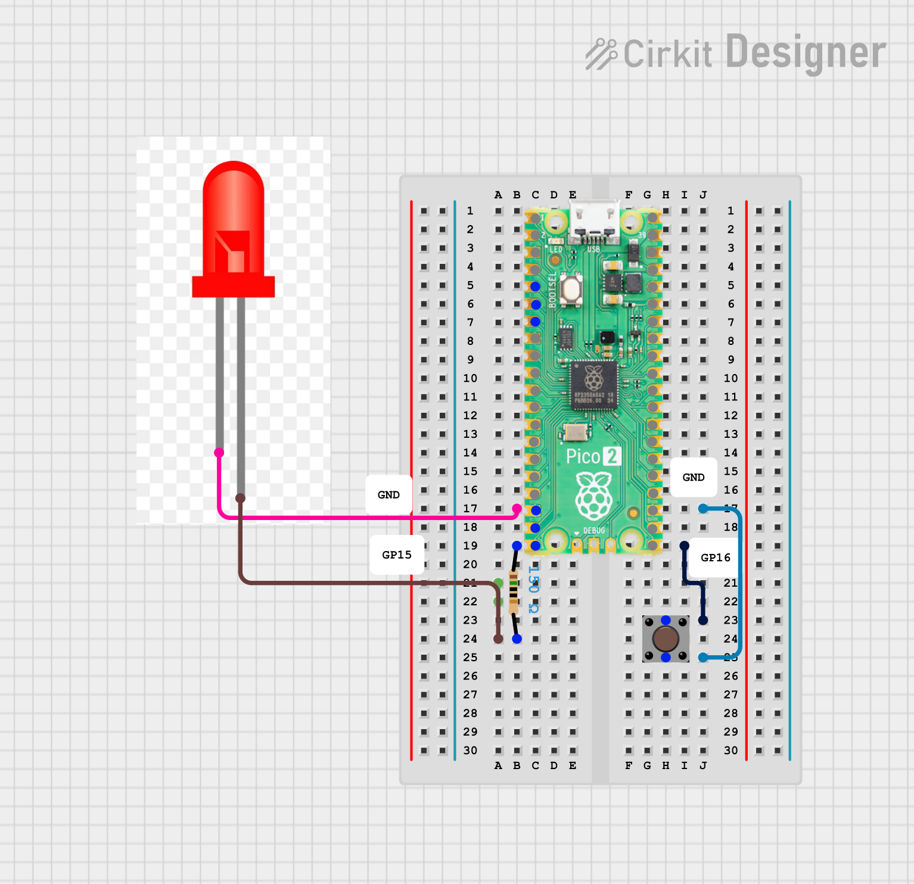
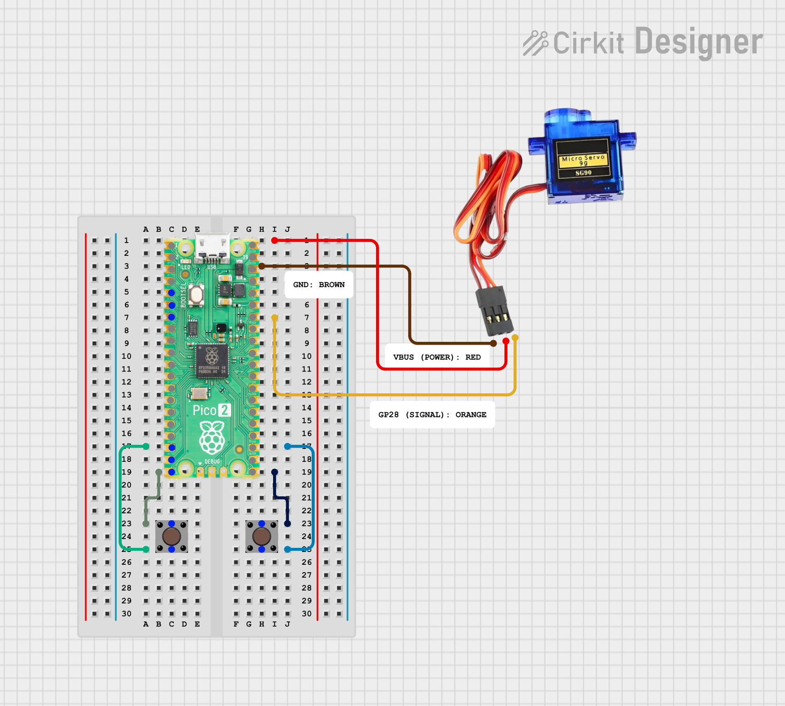

# wses-robotics
## Adding Switch
<table>
  <tr>
    <td width="50%" valign="top">
      <strong>The Circuit</strong> 
      
    </td>
    <td width="50%" valign="top">
      <strong>The Python Code</strong>

<pre><code>
from machine import Pin, PWM
import time

# SER0006 signal on GP28
servo = PWM(Pin(28))
servo.freq(50)  # Standard servo frequency: 50 Hz

# Switches (active-low with internal pull-up)
sw_inc = Pin(16, Pin.IN, Pin.PULL_UP)  # Increase angle
sw_dec = Pin(15, Pin.IN, Pin.PULL_UP)  # Decrease angle

MIN_ANGLE = 0
MAX_ANGLE = 180
STEP = 5
angle = 90

def angle_to_duty_u16(deg):
    # Map 0..180 deg to 500..2500 us pulse width at 50 Hz.
    min_us = 500
    max_us = 2500
    pulse_us = min_us + (max_us - min_us) * deg // 180
    return int(pulse_us * 65535 / 20000)

def set_angle(deg):
    servo.duty_u16(angle_to_duty_u16(deg))

set_angle(angle)

while True:
    changed = False

    if sw_inc.value() == 0 and angle < MAX_ANGLE:
        angle += STEP
        if angle > MAX_ANGLE:
            angle = MAX_ANGLE
        changed = True

        # Wait for button release (debounce / single step per press)
        while sw_inc.value() == 0:
            time.sleep_ms(10)

    if sw_dec.value() == 0 and angle > MIN_ANGLE:
        angle -= STEP
        if angle < MIN_ANGLE:
            angle = MIN_ANGLE
        changed = True

        # Wait for button release (debounce / single step per press)
        while sw_dec.value() == 0:
            time.sleep_ms(10)

    if changed:
        set_angle(angle)

    time.sleep_ms(20)

    </code></pre>
    
  </tr>
</table>

## Servo Control
<table>
  <tr>
    <td width="50%" valign="top">      
      <strong>The Circuit</strong>
            
    </td>
    <td width="50%" valign="top">
      <strong>The Python Code</strong>

<pre><code>
from machine import Pin, PWM
import time

# SER0006 signal on GP28
servo = PWM(Pin(28))
servo.freq(50)  # Standard servo frequency: 50 Hz

# Switches (active-low with internal pull-up)
sw_inc = Pin(16, Pin.IN, Pin.PULL_UP)  # Increase angle
sw_dec = Pin(15, Pin.IN, Pin.PULL_UP)  # Decrease angle

MIN_ANGLE = 0
MAX_ANGLE = 180
STEP = 5
angle = 90
  
def angle_to_duty_u16(deg):
    # Map 0..180 deg to 500..2500 us pulse width at 50 Hz.
    min_us = 500
    max_us = 2500
    pulse_us = min_us + (max_us - min_us) * deg // 180
    return int(pulse_us * 65535 / 20000)

def set_angle(deg):
    servo.duty_u16(angle_to_duty_u16(deg))
set_angle(angle)

while True:
    changed = False

    if sw_inc.value() == 0 and angle < MAX_ANGLE:
        angle += STEP
        if angle > MAX_ANGLE:
            angle = MAX_ANGLE
        changed = True

        # Wait for button release (debounce / single step per press)
        while sw_inc.value() == 0:
            time.sleep_ms(10)

    if sw_dec.value() == 0 and angle > MIN_ANGLE:
        angle -= STEP
        if angle < MIN_ANGLE:
            angle = MIN_ANGLE
        changed = True

        # Wait for button release (debounce / single step per press)
        while sw_dec.value() == 0:
            time.sleep_ms(10)

    if changed:
        set_angle(angle)

    time.sleep_ms(20)
</code></pre>
  </tr>
</table>
