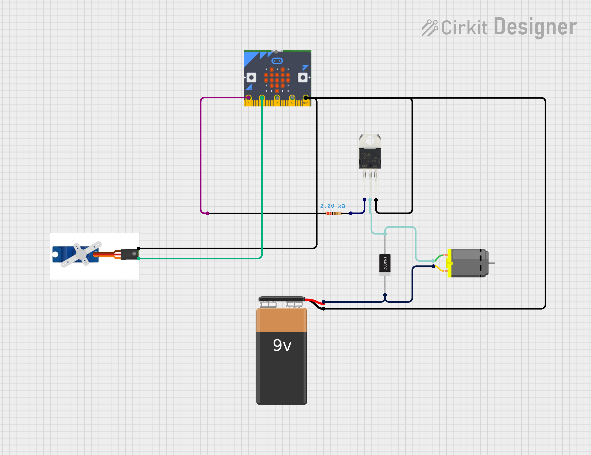

<!-- Styles for the copy button -->

<a href="https://python.microbit.org/v/3" target="_blank">Click here for the micro:bit Web Programmer to open in a new tab</a>

<a href="https://makecode.microbit.org/" target="_blank">Click here if you want to program using Blocks!</a>

# Circuit Diagram
<a href="https://app.cirkitdesigner.com/project/0213eed6-16af-4f01-b41b-4eb8e486daf5" target="_blank"> Link to cirkidesigner!</a>

# Remote Control!
<table>
  <tr>    
    <td width="50%" valign="top">
      <strong>The Python Code</strong>
      

        <button class="copy-btn" onclick="copyCode('code3', this)">Copy</button>
        <pre><code id="code3">
          
from microbit import *
import radio

# Turn on the radio and set a channel
radio.on()
radio.config(channel=7)

# Default values
steering = "center"

while True:
    # 1. Handle Steering Input & Set LED Arrows
    if button_a.is_pressed() and button_b.is_pressed():
        steering = "center"
        display.show(Image.ARROW_N) # North arrow for straight ahead
    elif button_a.is_pressed():
        steering = "left"
        display.show(Image.ARROW_W) # West arrow for left
    elif button_b.is_pressed():
        steering = "right"
        display.show(Image.ARROW_E) # East arrow for right
    else:
        # If no buttons are pressed, clear the steering arrow 
        # so we can show the speed indicator instead
        display.clear()
        
    # 2. Handle Speed Input (Tilt Forward/Backward)
    tilt_y = accelerometer.get_y()
    
    if tilt_y < -200:
        speed = min(100, abs(tilt_y) // 10)
    else:
        speed = 0 
        
    # 3. If driving straight, show speed as a "progress bar" on the LEDs
    if steering == "center":
        # Light up rows based on speed percentage
        display.clear()
        rows_to_light = min(5, speed // 20) # 0 to 5 rows
        for y in range(5 - rows_to_light, 5):
            for x in range(5):
                display.set_pixel(x, y, 9) # Max brightness
                
    # 4. Send the data
    command = "{},{}".format(steering, speed)
    radio.send(command)
    
    sleep(50)
    
    </code></pre>
      

    </td>
  </tr>
</table>

# Car Control!
<table>
  <tr>    
    <td width="50%" valign="top">
      <strong>The Python Code</strong>
      

        <button class="copy-btn" onclick="copyCode('code3', this)">Copy</button>
        <pre><code id="code3">
          
from microbit import *
import radio

# Turn on the radio and match the channel
radio.on()
radio.config(channel=7)

# Set initial PWM periods for Servo
pin1.set_analog_period_microseconds(20000) 

def set_servo_angle(pin, angle):
    duty = int(50 + (angle / 180) * 65)
    pin.write_analog(duty)

# Initialize car states
set_servo_angle(pin1, 90) 
pin0.write_analog(0)      
display.clear()

while True:
    message = radio.receive()
    
    if message:
        try:
            # Split the incoming string
            steering, speed_str = message.split(",")
            speed_pct = int(speed_str)
            
            # --- LED INDICATOR (Flash center pixel to show data receipt) ---
            display.set_pixel(2, 2, 9)
            
            # 1. Control the Servo (Pin 1)
            if steering == "left":
                set_servo_angle(pin1, 45)  
            elif steering == "right":
                set_servo_angle(pin1, 135) 
            else:
                set_servo_angle(pin1, 90)  
                
            # 2. Control the DC Motor Speed (Pin 0)
            pwm_value = int((speed_pct / 100) * 1023)
            pin0.write_analog(pwm_value)
            
        except ValueError:
            pass
    else:
        # If no radio message was received in this loop, turn off the indicator
        display.set_pixel(2, 2, 0)
            
    sleep(20)
    
    </code></pre>
      

    </td>
  </tr>
</table>

<!-- JavaScript for the copy functionality -->

