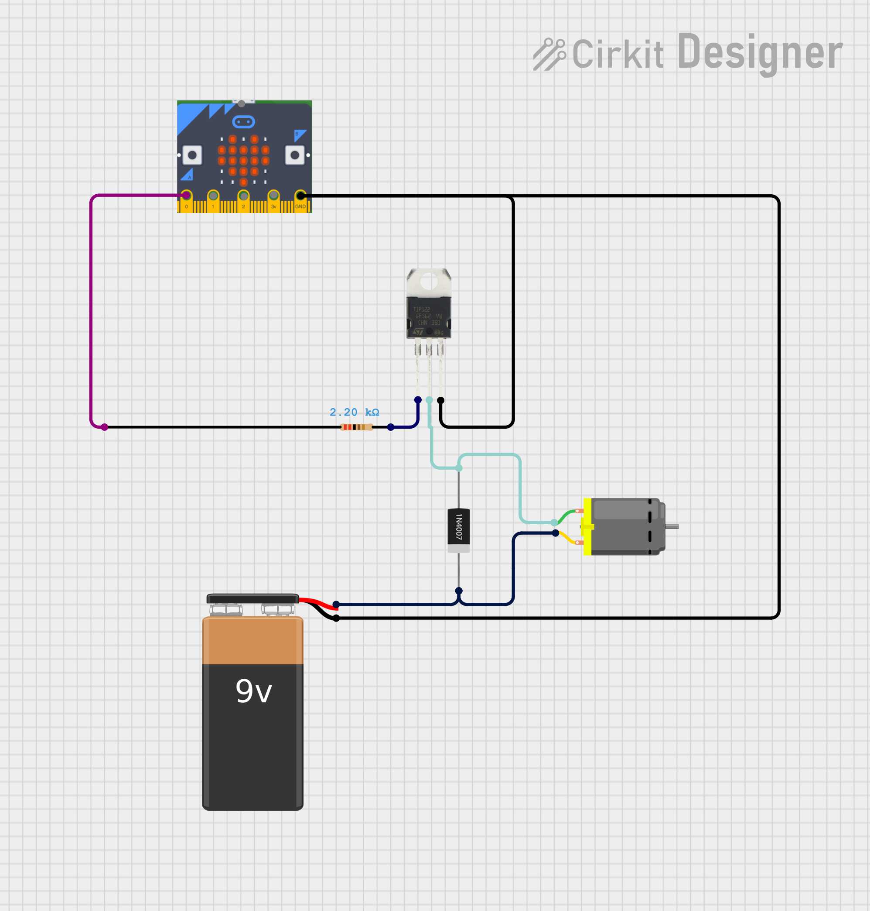

<!-- Styles for the copy button -->

<a href="https://python.microbit.org/v/3" target="_blank">Click here for the micro:bit Web Programmer to open in a new tab</a>

<a href="https://makecode.microbit.org/" target="_blank">Click here if you want to program using Blocks!</a>

# Circuit Diagram
<a href="https://app.cirkitdesigner.com/project/d3682d71-2df9-41ce-a4b0-2a48508eead1" target="_blank"> Link to cirkidesigner!</a>

# Remote Control!
<table>
  <tr>    
    <td width="50%" valign="top">
      <strong>The Python Code</strong>
      

        <button class="copy-btn" onclick="copyCode('code3', this)">Copy</button>
        <pre><code id="code3">
          
from microbit import *
import radio

   # Turn on the radio and set a channel (must match the car)
channel_no = 7
radio.on()
radio.config(channel=channel_no)

     # Default values
steering = "center"

while True:
    # 1. Handle Steering Input (Buttons)
    if button_a.is_pressed() and button_b.is_pressed():
        steering = "center"
    elif button_a.is_pressed():
        steering = "left"
    elif button_b.is_pressed():
        steering = "right"
        
    # 2. Handle Speed Input (Tilt Forward/Backward)
    # y-axis gives negative values when tilted forward, positive when backward
    tilt_y = accelerometer.get_y()
    
    # Map the tilt to a speed scale (0 to 100)
    # We only care about tilting forward to go forward for this simple code
    if tilt_y < -200:
        # Convert negative tilt into a positive speed value (max ~100)
        speed = min(100, abs(tilt_y) // 10)
    else:
        speed = 0 # Stop if level or tilted backward
        
    # 3. Send the data as a string (e.g., "left,50")
    command = "{},{}".format(steering, speed)
    radio.send(command)
    
    # Brief pause to keep the radio clear
    sleep(50)
    
    </code></pre>
      

    </td>
  </tr>
</table>

<!-- JavaScript for the copy functionality -->

